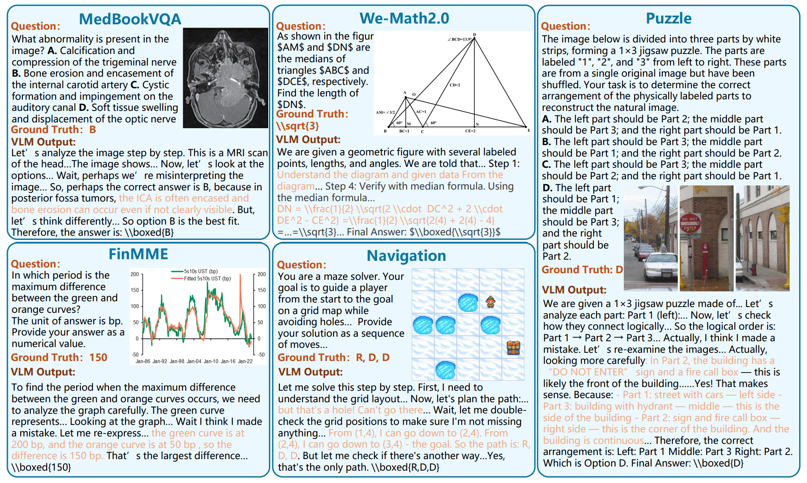
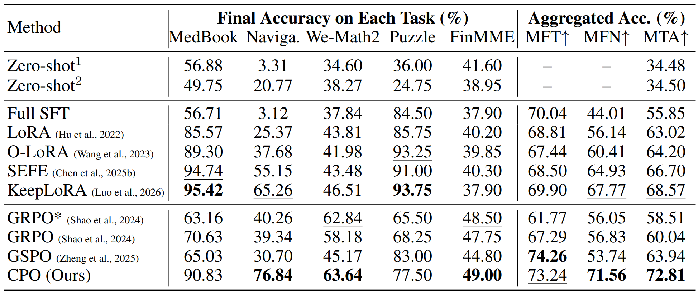
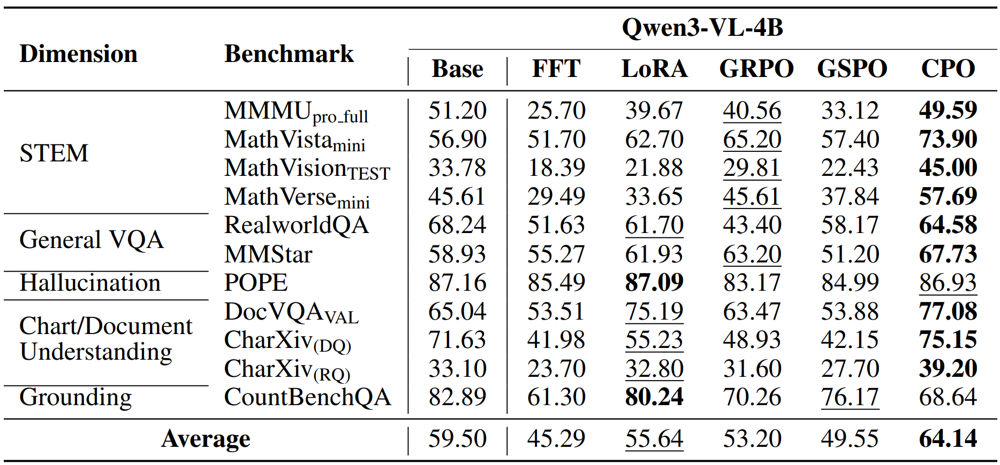

# Multimodal Continual RLVR

This private research codebase builds on the official **RL Forgets / CPO / MRCL** release and adds reproducible local experiment tooling plus Current-State Tangent-Aware Isospectral Update Redirection (CTIR). The original project attribution and citation are retained below.

For the complete four-H100 CTIR run over T1 through T5, use the pinned setup and launch procedure in [CTIR_MULTITASK_H100_4GPU.md](CTIR_MULTITASK_H100_4GPU.md). That launcher keeps the four-card PRO 6000 batch protocol (`8 × 4 × gradient accumulation 4 = 128`) and runs a mandatory worst-case two-step memory preflight before formal T1.

<p align="center">
  <a href="https://huggingface.co/datasets/MaolinLuo/MRCL"></a>
  &nbsp;&nbsp;
  <a href="https://arxiv.org/abs/2607.04364"></a>
</p>

This repository contains the implementation of **Continual Policy Optimization (CPO)** and the **Multimodal Reasoning Continual Learning (MRCL)** benchmark. MRCL evaluates continual post-training on five recent and diverse tasks. CPO is a replay-free method that constrains movement on parameters identified as important to previous tasks.

Experiments on Qwen3-VL-2B, Qwen3-VL-4B, and Qwen3-VL-8B consistently show that CPO improves final retention over standard RL baselines while maintaining strong task adaptation, demonstrating that the method scales across model sizes.



<details>
<summary><strong>Qwen3-VL-4B results</strong></summary>





</details>

## Setup

The paper experiments use Linux, NVIDIA H100 GPUs, Python 3.12, and CUDA 12.8. RL launchers are configured for eight GPUs; restrict visible devices with `CUDA_VISIBLE_DEVICES` if needed.

Training:

```bash
conda create -n trlQwen python=3.12 -y
conda activate trlQwen
pip3 install torch==2.8.0 torchvision==0.23.0 torchaudio==2.8.0 --index-url https://download.pytorch.org/whl/cu128
pip install psutil ninja einops
pip install flash-attn==2.8.3 --no-build-isolation
pip install -r requirements.txt
python -c "import nltk, sys, os; nltk_dir = os.path.join(sys.prefix, 'share', 'nltk_data'); os.makedirs(nltk_dir, exist_ok=True); nltk.download('punkt_tab', download_dir=nltk_dir)"
pip install deepspeed==0.16.4
```

Evaluation:

```bash
conda create -n vllmQwen python=3.12 -y
conda activate vllmQwen
pip3 install torch==2.9.0 torchvision==0.24.0 torchaudio==2.9.0 --index-url https://download.pytorch.org/whl/cu128
pip install -r requirements_eval.txt
python -c "import nltk, sys, os; nltk_dir = os.path.join(sys.prefix, 'share', 'nltk_data'); os.makedirs(nltk_dir, exist_ok=True); nltk.download('punkt_tab', download_dir=nltk_dir)"
pip install vllm==0.11.2
```

The GPU configurations used in the paper are:

| Model | LoRA-based methods | Full SFT | RL methods |
| --- | ---: | ---: | ---: |
| Qwen3-VL-2B | 1 | 2 | 8 |
| Qwen3-VL-4B | 1 | 2 | 8 |
| Qwen3-VL-8B | 2 | 4 | 8 |

All numbers refer to NVIDIA H100 GPUs. RL methods include GRPO, GSPO, and CPO.

## Data

Set `BASE_PATH` in the launch script to the MRCL root:

```text
MRCL/
├── MedBookVQA/
├── Navigation/
├── We-Math2/
├── Puzzle/
└── FinMME/

<TASK>/
├── images/
└── jsons/
    ├── train/data.json
    └── test/data.json
```

Each `data.json` is a JSON array. A record contains `conversations` and an `image` field; FinMME numerical records also contain `tolerance`.

<details>
<summary><strong>External evaluation data</strong></summary>

Download [MMMU-Pro](https://huggingface.co/datasets/MMMU/MMMU_Pro/tree/main), [MathVerse](https://huggingface.co/datasets/AI4Math/MathVerse/blob/main/testmini.parquet), [MathVision](https://huggingface.co/datasets/MathLLMs/MathVision/blob/main/data/test-00000-of-00001-3532b8d3f1b4047a.parquet), [MathVista](https://huggingface.co/datasets/AI4Math/MathVista/blob/main/data/testmini-00000-of-00001-725687bf7a18d64b.parquet), [RealWorldQA](https://huggingface.co/datasets/xai-org/RealworldQA/tree/main/data), [MMStar](https://huggingface.co/datasets/Lin-Chen/MMStar/blob/main/mmstar.parquet), [DocVQA](https://huggingface.co/datasets/lmms-lab/DocVQA/tree/main/DocVQA), [CharXiv](https://huggingface.co/datasets/princeton-nlp/CharXiv/blob/main/val.parquet), [CountBenchQA](https://huggingface.co/datasets/vikhyatk/CountBenchQA/blob/main/data/test-00000-of-00001.parquet), and [POPE](https://github.com/AoiDragon/POPE/tree/main/output/coco).

```text
Eval_OOD_Datasets/
├── MMMU_pro/
│   ├── standard (4 options)/
│   ├── standard (10 options)/
│   └── vision/
├── POPE/
│   ├── coco_pope.json
│   └── coco/image/
├── MathVerse/
├── MathVision/
├── MathVista/
├── RealworldQA/
├── MMStar/
├── DocVQA/
├── Charxiv/
└── CountBenchQA/
```

#### Note:

- For MathVerse: Download the `testmini.parquet` and rename it as `test-00000-of-00001.parquet`.
- For MathVision and MathVista: Rename the file to `test-00000-of-00001.parquet`.
- For MMStar: Rename the file to `test-00000-of-00001.parquet` (original filename: `mmstar.parquet`).
- For POPE: Download the `coco_pope_adversarial.json` and rename it as `coco_pope.json`. Download and extract the [COCO](https://www.modelscope.cn/datasets/OmniData/COCO_2014/file/view/master/raw%2Fval2014.zip?id=28705&status=2) image files to the path `/POPE/coco/`.
- For DocVQA: Download the `validation-00000-of-00006.parquet` to `validation-00005-of-00006.parquet`.
- For Charxiv: Download the `val.parquet` and rename it as `validation-00000-of-00001.parquet`.

</details>

## Training and evaluation

Run commands from the repository root. First edit `BASE_MODEL` and `BASE_PATH` of the selected launcher.

```bash
# Qwen3-VL-2B: CPO
bash scripts/GSPO-CL/run_cpo.sh

# Qwen3-VL-4B: CPO
bash scripts/GSPO-CL-4B/run_cpo.sh

# Qwen3-VL-8B: CPO
bash scripts/GSPO-CL-8B/run_cpo.sh
```

<details>
<summary><strong>Baseline launchers</strong></summary>

```bash
# Qwen3-VL-2B: Full SFT
bash scripts/SFT-CL/run_all_FFT.sh
# Qwen3-VL-2B: LoRA
bash scripts/LoRA-CL/run_all.sh
# Qwen3-VL-2B: O-LoRA
bash scripts/OLoRA-CL/run_all.sh
# Qwen3-VL-2B: RegLoRA
bash scripts/RegLoRA-CL/run_all.sh
# Qwen3-VL-2B: KeepLoRA
bash scripts/KeepLoRA-CL/run_all.sh
# Qwen3-VL-2B: GRPO
bash scripts/GRPO-CL/run_cl.sh
# Qwen3-VL-2B: GSPO
bash scripts/GSPO-CL/run_cl.sh

# Qwen3-VL-4B: Full SFT
bash scripts/SFT-CL-4B/run_all_FFT.sh
# Qwen3-VL-4B: LoRA
bash scripts/LoRA-CL-4B/run_all.sh
# Qwen3-VL-4B: O-LoRA
bash scripts/OLoRA-CL-4B/run_all.sh
# Qwen3-VL-4B: RegLoRA
bash scripts/RegLoRA-CL-4B/run_all.sh
# Qwen3-VL-4B: KeepLoRA
bash scripts/KeepLoRA-CL-4B/run_all.sh
# Qwen3-VL-4B: GRPO
bash scripts/GRPO-CL-4B/run_cl.sh
# Qwen3-VL-4B: GSPO
bash scripts/GSPO-CL-4B/run_cl.sh

# Qwen3-VL-8B: Full SFT
bash scripts/SFT-CL-8B/run_all_FFT.sh
# Qwen3-VL-8B: LoRA
bash scripts/LoRA-CL-8B/run_all.sh
# Qwen3-VL-8B: O-LoRA
bash scripts/OLoRA-CL-8B/run_all.sh
# Qwen3-VL-8B: RegLoRA
bash scripts/RegLoRA-CL-8B/run_all.sh
# Qwen3-VL-8B: KeepLoRA
bash scripts/KeepLoRA-CL-8B/run_all.sh
# Qwen3-VL-8B: GRPO
bash scripts/GRPO-CL-8B/run_cl.sh
# Qwen3-VL-8B: GSPO
bash scripts/GSPO-CL-8B/run_cl.sh
```

</details>

For standalone zero-shot or external evaluation, edit the model and data paths in the corresponding script:

```bash
bash scripts/eval_zeroshot.sh
bash scripts/eval_zeroshot_ood.sh
```

## CTIR: closest feasible isospectral transport

CTIR intercepts the complete FP32 AdamW parameter delta at a real DeepSpeed optimizer boundary. Rank-8 raw and old-task singular frames determine an identity-connected principal-plane rotation, but the rotation is applied to the complete delta:

```text
delta_redirected = R_left @ delta_raw @ R_right.T
```

No singular values are discarded. The global beta controller keeps at least 90% of the raw new-task descent proxy, minimizes positive old-task harm-constraint violation, and then chooses the candidate closest to the raw update in Frobenius distance.

The complete four-GPU T4 protocol is recorded in `configs/ctir_t4_300_direct.yaml`. On a shared host, queue it in a detached tmux watcher that launches as soon as physical GPUs 0–3 are all idle:

```bash
bash scripts/CTIR-T4-300/launch_when_gpus_free.sh
bash scripts/CTIR-T4-300/launch_when_gpus_free.sh --status
```

By default, "idle" means zero compute processes and at most 512 MiB allocated on every target GPU. The watcher polls every two seconds and confirms once more after one second before replacing itself with `run.sh`. These operational values can be changed with `CTIR_IDLE_MEMORY_MIB`, `CTIR_GPU_POLL_SECONDS`, and `CTIR_GPU_CONFIRM_SECONDS`. Direct foreground launch remains available as `bash scripts/CTIR-T4-300/run.sh`.

The launcher expects local model checkpoints and MRCL data; neither model weights nor runtime experiment products belong in Git. The Navigation geometry manifest is generated locally with `scripts/CTIR-T4-60/freeze_probes.py` and uses 32 train samples, seed 142, and each sample's complete `full_text_only_thought` as the teacher-forced target.

## Citation

```bibtex
@article{luo2026rl,
    title={RL Forgets! Towards Continual Policy Optimization},
    author={Luo, Mao-Lin and Wang, Zhe-Xu and Zhou, Zi-Hao and Ye, Bo and Zhao, Jian and Zhang, Min-Ling and Wei, Tong},
    journal={arXiv preprint arXiv:2607.04364},
    year={2026}
}
```
